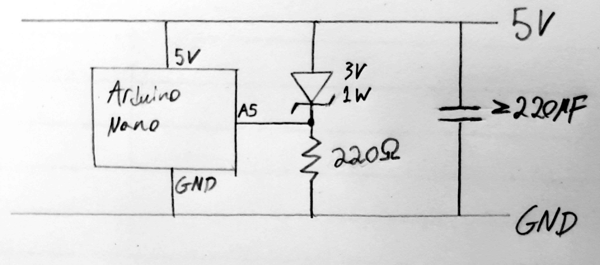

# Arduino Light Switcher

> A Modular Device for Smart Home Automation of Lights and More
- [ABOUT](#ABOUT)
- [SETUP](#SETUP)
- [CREATION](#CREATION)
- [EXAMPLES](#EXAMPLES)


# ABOUT
This device is a set of modules, each of which fits within 1 of 3 categories: Triggers, Modifiers, Actions.

#### Actions:
Press, Toggle, Transmit, etc. These modules preform 2 types of actions corresponding to the concepts of "on" or "off".

Examples:
- `servo module`: presses physical rocker switches.
- `tx module`: transmits 2 different codes, one for on, one for off.

#### Triggers:
Triggers an action, either on or off.

Examples:
- `rx module`: receives 2 different codes, on and off.
- `motion sensor module:` triggers on when movement is detected and off when movement stops.
- `power module`: triggers on when device is powered on, off when device is powered off.


#### Modifiers
Stands between the trigger and the action, takes in the output of the trigger along with external data and controls the action.

Examples:
- `light sensor module`: used to control lights that have multiple switches on the same circuit, takes in light data and self calibrates.


# SETUP
The capabilities of the device can be adjusted through the defines at the top of `arduino-light-switcher.ino` (IE enabling RF trigger or motion trigger), as for hardware, please refer to the CREATION section. 

I recommend enabling `DEBUG_LED_ENABLED` and `DEBUG_SERIAL_ENABLED` in `arduino-light-switcher.ino` while creating and working on the device.

The code depends on the Arduino libraries `rc-switch`, `Servo` and `LowPower_LowPowerLab` which can be installed using the IDE or arduino-cli.

To flash and run the project on Linux, use:
``` 
./run.sh
```
This will also cat the serial output of the Arduino to terminal for debugging, hit ctrl-c to close it. 


# CREATION
I will divide this section into each module. Here is a minimal list of materials common to all configurations:

#### Base Materials
The base setup of this project requires:
- project box (mine are 10x6x2.5 cm)
- drill
- hot glue gun
- 22 gauge solid core wire
- cable crimping tools and wire (or pre-crimped cables)
- screw block terminals (2 screw and 3 screw)
- Arduino nano
- bread board which fits into the project box (with clearance for components)
- USB a power cable and wall adapter


## Servo Module (ACTION)
Uses the servo to physically press rocker style light switches

#### Servo Materials
- servo motor
- M2.5 standoffs
- 3m command strips (or some other method of wall attachment)
- potentiometer
- toothpick

#### Servo Schematic


<br clear="left"/>
<br clear="left"/>

#### Servo Assembly
Thread 2 M2.5 screws through both mounting holes on the servo, attach 2 M2.5 female to male standoffs to either screw. The standoffs should be longer than the body of the servo with enough space to route cables underneath the servo case. 

Drill 2 holes into the project box to mount the servo+standoffs onto it, the holes should be drilled at the midpoint of the boxes depth as shown below.


<br clear="left"/>
<br clear="left"/>

Drill an additional hole between the previous 2 to run the servo cable beneath the servo case and into the project box.

Attach a toothpick to the servo arm with some hot glue and trim the ends of the toothpick so it can press the upper and lower part of the light switch.

#### Servo Configuration
If the switcher is going to be on the left side of the switch, enable `servo-invert` by pulling pin `A0` low, this is only read on restart.

Set the potentiometer to its midpoint and turn on the module, wait for it to run through its startup sequence. Then add the servo arm so it's parallel with the case (and hence the future wall). Note during normal operation, the potentiometer is only read on reset, adjusting it afterwards will have no effect till next reset (unless running one of the test modes mentioned below).

You can adjust the servo neutral position live by pulling pin `D11` low and resetting the module, reset again to end the test. Similarly, pulling pin `D12` low and resetting will run a test which presses up and down continuously, with live servo neutral and servo invert adjustments as well.

Adjust `SERVO_PRESS_ANGLE_UP` and `SERVO_PRESS_ANGLE_DOWN` if the module is still having trouble hitting both sides of the light switch (default values should be good).


## Power Trigger Module (Trigger)
Triggers `on` on when powered on, and `off` when power is lost

#### Power Trigger Materials
- $3V$ $1W$ zener diode
- $220 \Omega$ resistor
- $220 \mu F$  capacitor (exact value depends on wall adapter)

#### Power Trigger Schematic


<br clear="left"/>
<br clear="left"/>

#### Power Trigger Configuration

The exact value of the capacitor will depend on the capacitance of your wall adapter and how much needs to be done after a trigger. If the capacitance is too low, the arduino will blackout before it can trigger and preform the action. Capacitance that is too high will cause an unnecessary delay between being powered on/off and the trigger.

Note: This trigger is meant to be used with fast, low power actions (IE Tx Module). The Servo Module, for example, is likely to draw too much power to complete the action before power is lost.


## Rx Module (TRIGGER)
Triggers `on/off` based on programmed RF codes.

#### Rx Materials
- 433 MHz Rx Module
- 433 MHz antenna

#### Rx Schematic


<br clear="left"/>
<br clear="left"/>

#### Rx Configuration

The Rx module can be configured in `2-rx-code.ino` by editing: `ON_VALUE`, `OFF_VALUE`, `BIT_LENGTH` and `PROTOCOL`. To get these values, uncomment `testRx();` in `loop()` of `arduino-light-switcher.ino` and see what codes your RF remote/transmitter is sending out (`ENABLE_DEBUG_SERIAL` must be enabled to see the output).


## Tx Module (Action)
Transmits `on/off` codes.

#### Tx Materials
- 433 MHz Tx Module

#### Tx Schematic
None needed, simply connect unit to 5v, GND and connect `DATA` to the Arduino's `D8` pin.

#### Tx Configuration

The Tx module can be configured in `5-tx-code.ino` by editing: `ON_VALUE`, `OFF_VALUE`, `PULSE_LENGTH`, `BIT_LENGTH` and `PROTOCOL`. To get these values, if you have an Rx module, you can uncomment `testRx();` in `loop()` of `arduino-light-switcher.ino` and see what codes your RF remote/transmitter is sending out (`ENABLE_DEBUG_SERIAL` must be enabled to see the output). 


## Motion Sensor Module (TRIGGER)
Triggers `on` when motion is detected, `off` after it stops (with adjustable delay).

#### Motion Sensor Materials
- HC-SR501 PIR motion sensor
- 0.1nF capacitor (or similar value)
- twist ties

#### Motion Sensor Schematic


<br clear="left"/>
<br clear="left"/>

#### Motion Sensor Assembly
Set the motion sensor to repeat trigger mode (there should be 3 pins with a pin jumper cover which can be moved), see your module's docs for more details.

Drill 2 level holes in the project box lid with the same spacing as the motion sensor mounting holes, we will be mounting the sensor with its built in potentiometers facing up. Cut/Drill a slot in the project box case where the sensors pins will be once its mounted, with enough space for the future connectors to fit through it.

Thread a twist tie through the front of one hole in the lid and back out the other. Thread either end of the twist tie through the mounting holes on the motion sensor, loop each end around the outside of the PCB and back through the project box lid holes. Secure the twist ties on the inside of the lid with some tape. 


<br clear="left"/>
<br clear="left"/>

#### Motion Sensor Configuration

Ensure the motion sensor is in repeat trigger mode as mentioned above. Adjust the potentiometers on the motion sensor for the desired sensitivity and `on` duration for your application (I find 2 minutes duration good for most purposes).


## Light Sensor Module (MODIFIER)
Makes the device able to control light sources which have multiple switches on the same circuit.


#### Light Sensor Materials
- photoresistor
- resistor with a value around the midpoint of the photoresistor
- clear tape
  
#### Light Sensor Schematic


<br clear="left"/>
<br clear="left"/>

#### Light Sensor Assembly
Drill a hole in the project box in the direction of the light that is going to be switched, the hole needs to be large enough to fit the photoresistor. Apply a small square of tape over the hole, stick the photoresistor to the tape. Pot the photoresistor in hot glue, leaving the leads exposed.

If there are other lights in the room the device may occasionally flicker the light on and off when switching it, or assume the light is already on or off when it isn't and refuse to switch. To fix this you can create a light shade using some black tape. In extreme cases, create a small tube with black tape and direct it towards the light source which is being switched. The device will re-calibrate on restart, or whenever it presses both side of the light switch when switching. 

#### Light Sensor Configuration
Adjust `LIGHT_SWITCH_RESPONSE_DELAY` in `4-light-sensor.ino` as needed, depending on how long it takes the light to turn on/off after whatever controls it is toggled (IE a switch). The device with wait this many milliseconds after toggling the light to measure brightness.


# EXAMPLES
Here is an Rx Triggered module with a light sensor which presses rocker switches (used to control lights that are attached to multiple switches)
Rx `Trigger`, Light Sensor `Modifier`, Servo `Action`:


<br clear="left"/>
<br clear="left"/>


Here is a power controlled Tx Transmitter (turns a switchable outlet into an RF transmitter)
Power `Trigger`, Tx `Action`:


<br clear="left"/>
<br clear="left"/>


Here is a Rx Triggered Tx Transmitter (acts like either a radio relay, or RF translator from one set of on/off codes to another)
Rx `Trigger`, Tx `Action`:


<br clear="left"/>
<br clear="left"/>


Here is a Motion Triggered module which presses rocker switches (turns on the light when you enter the room, and off after you leave)
Motion `Trigger`, Servo `Action`:


<br clear="left"/>
<br clear="left"/>
