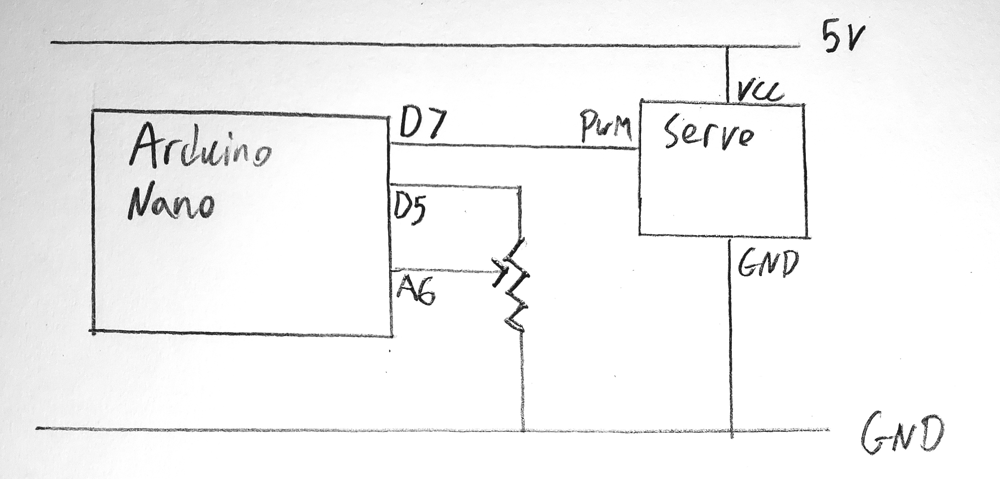
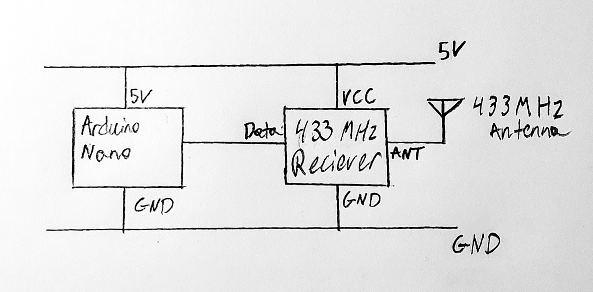
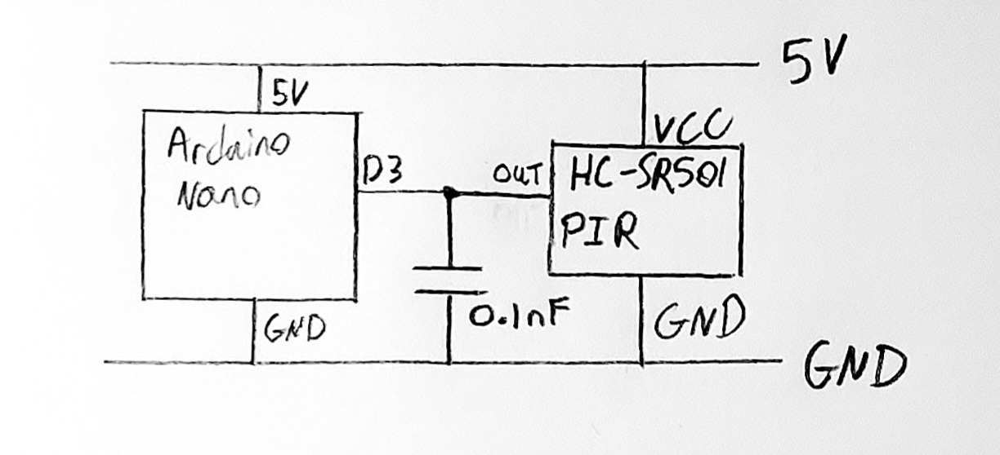
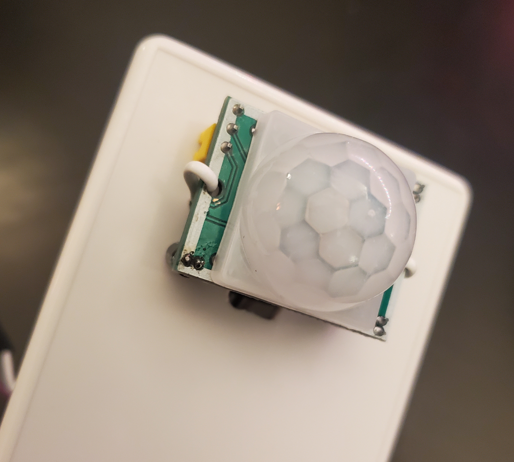
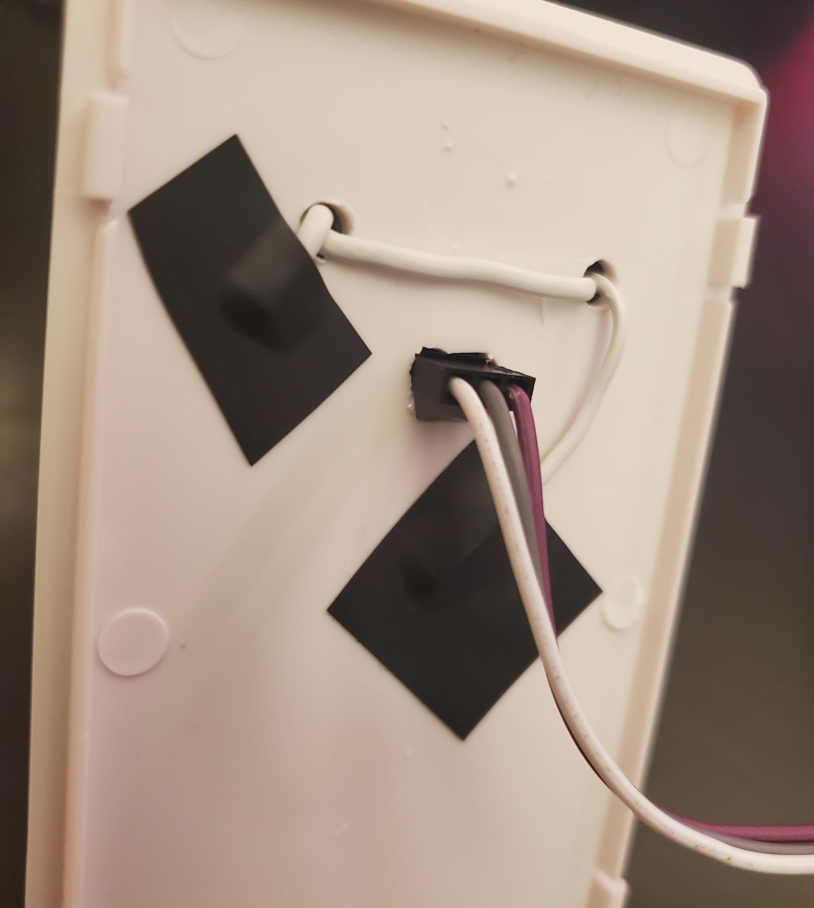
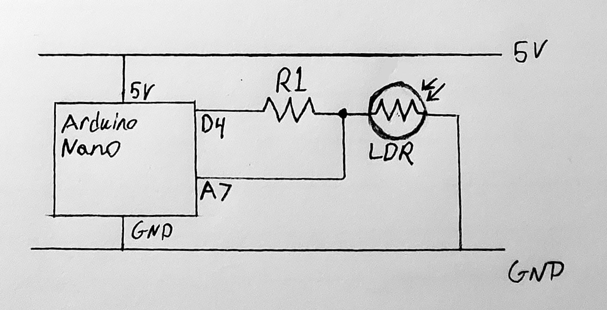
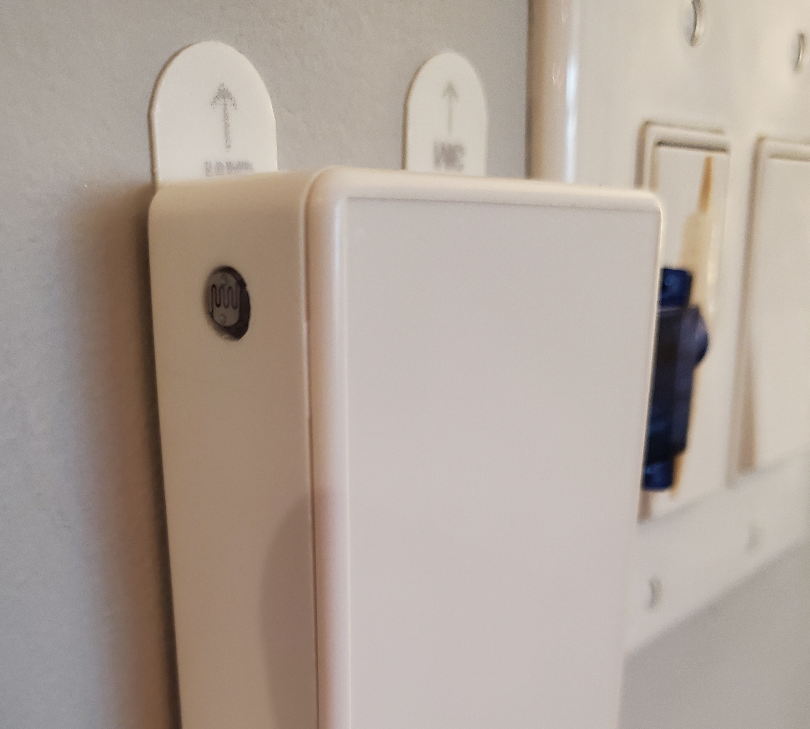

# Arduino Light Switcher

> A Modular Device to Physically Press Switches
- [ABOUT](#ABOUT)
- [SETUP](#SETUP)
- [CREATION](#CREATION)
- [EXAMPLE](#EXAMPLE)


# ABOUT
This device will physically toggle rocker light switches based on detected motion, or an RF signal (depending on the configuration). In addition to this, the device can be made light sensitive for lights that are toggled by multiple switches (where each switch behaves like a toggle). 

The capabilities of the device can be adjusted through the defines at the top of `arduino-light-switcher.ino` (IE enabling RF trigger or motion trigger), as for hardware, please refer to the SETUP section. 


# SETUP
I recommend enabling `DEBUG_LED_ENABLED` and `DEBUG_SERIAL_ENABLED` in `arduino-light-switcher.ino` while creating and working on the device.

The code depends on the Arduino libraries `rc-switch`, `Servo` and `LowPower_LowPowerLab` which can be installed using the IDE or arduino-cli.

To flash and run the project on Linux, use:
``` 
./run.sh
```
This will also cat the serial output of the Arduino to terminal for debugging, hit ctrl-c to close it. 

Pulling pin `D11` or `D12` low and resetting will run a live servo adjustment test, and a continuous presser test respectively (for more info read the configuration section of the base module).


# CREATION
I will divide this section into each module.

## Base Module
Includes the Arduino, power, and servo.

#### Base Materials
The base setup of this project requires:
- project box (mine are 10x6x2.5 cm)
- drill
- hot glue gun
- servo motor
- M2.5 standoffs
- 22 gauge solid core wire
- cable crimping tools and wire (or pre-crimped cables)
- screw block terminals (2 screw and 3 screw)
- Arduino nano
- bread board which fits into the project box (with clearance for components)
- 3m command strips (or some other method of wall attachment)
- USB a power cable and wall adapter
- potentiometer
- toothpick

#### Base Schematic


<br clear="left"/>
<br clear="left"/>

#### Base Assembly
Thread 2 M2.5 screws through both mounting holes on the servo, attach 2 M2.5 female to male standoffs to either screw. The standoffs should be longer than the body of the servo with enough space to route cables underneath the servo case. 

Drill 2 holes into the project box to mount the servo+standoffs onto it, the holes should be drilled at the midpoint of the boxes depth as shown below.


<br clear="left"/>
<br clear="left"/>

Drill an additional hole between the previous 2 to run the servo cable beneath the servo case and into the project box.

Attach a toothpick to the servo arm with some hot glue and trim the ends of the toothpick so it can press the upper and lower part of the light switch.

#### Base Configuration
If the switcher is going to be on the left side of the switch, enable `SERVO_INVERT` in `1-servo-presser.ino`.

Set the potentiometer to its midpoint and turn on the module, wait for it to run through its startup sequence. Then add the servo arm so it's parallel with the case (and hence the future wall). Note during normal operation, the potentiometer is only read on reset, adjusting it afterwards will have no effect till next reset (unless running one of the test modes mentioned below).

You can adjust the servo neutral position live by pulling pin `D11` low and resetting the module, reset again to end the test. Similarly, pulling pin `D12` low and resetting will run a test which presses up and down continuously, with live servo neutral adjustments aswell.

Adjust `SERVO_PRESS_ANGLE_UP` and `SERVO_PRESS_ANGLE_DOWN` if the module is still having trouble hitting both sides of the light switch (default values should be good).

## Rx Module
Triggers the switch based on RF codes.

#### Rx Materials
- 433 MHz Rx Module
- 433 MHz antenna

#### Rx Schematic


<br clear="left"/>
<br clear="left"/>

#### Rx Configuration

The Rx module can be configured in `2-rx-code.ino` by editing: `ON_VALUE`, `OFF_VALUE`, `BIT_LENGTH` and `PROTOCOL`. To get these values, uncomment `testRx();` in `loop()` of `arduino-light-switcher.ino` and see what codes your RF remote/transmitter is sending out (`ENABLE_DEBUG_SERIAL` must be enabled to see the output).


## Motion Sensor Module
Triggers the switch based on detected motion.

#### Motion Sensor Materials
- HC-SR501 PIR motion sensor
- 0.1nF capacitor (or similar value)
- twist ties

#### Motion Sensor Schematic


<br clear="left"/>
<br clear="left"/>

#### Motion Sensor Assembly
Set the motion sensor to repeat trigger mode (there should be 3 pins with a pin jumper cover which can be moved), see your module's docs for more details.

Drill 2 level holes in the project box lid with the same spacing as the motion sensor mounting holes, we will be mounting the sensor with its built in potentiometers facing up. Cut/Drill a slot in the project box case where the sensors pins will be once its mounted, with enough space for the future connectors to fit through it.

Thread a twist tie through the front of one hole in the lid and back out the other. Thread either end of the twist tie through the mounting holes on the motion sensor, loop each end around the outside of the PCB and back through the project box lid holes. Secure the twist ties on the inside of the lid with some tape. 



<br clear="left"/>
<br clear="left"/>

#### Motion Sensor Configuration

Ensure the motion sensor is in repeat trigger mode as mentioned above. Adjust the potentiometers on the motion sensor for the desired sensitivity and `on` duration for your application (I find 2 minutes duration good for most purposes).


## Light Sensor Module
Makes the device compatible with lights which have multiple switches on the same circuit.


#### Light Sensor Materials
- photoresistor
- resistor with a value around the midpoint of the photoresistor
- clear tape
  
#### Light Sensor Schematic


<br clear="left"/>
<br clear="left"/>

#### Light Sensor Assembly
Drill a hole in the project box in the direction of the light that is going to be switched, the hole needs to be large enough to fit the photoresistor. Apply a small square of tape over the hole, stick the photoresistor to the tape. Pot the photoresistor in hot glue, leaving the leads exposed.

If there are other lights in the room the device may occasionally flicker the light on and off when switching it, or assume the light is already on or off when it isn't and refuse to switch. To fix this you can create a light shade using some black tape. In extreme cases, create a small tube with black tape and direct it towards the light source which is being switched. The device will re-calibrate on restart, or whenever it presses both side of the light switch when switching. 


# EXAMPLE
Here is an example of a Rx Triggered module with a light sensor:




<br clear="left"/>
<br clear="left"/>
