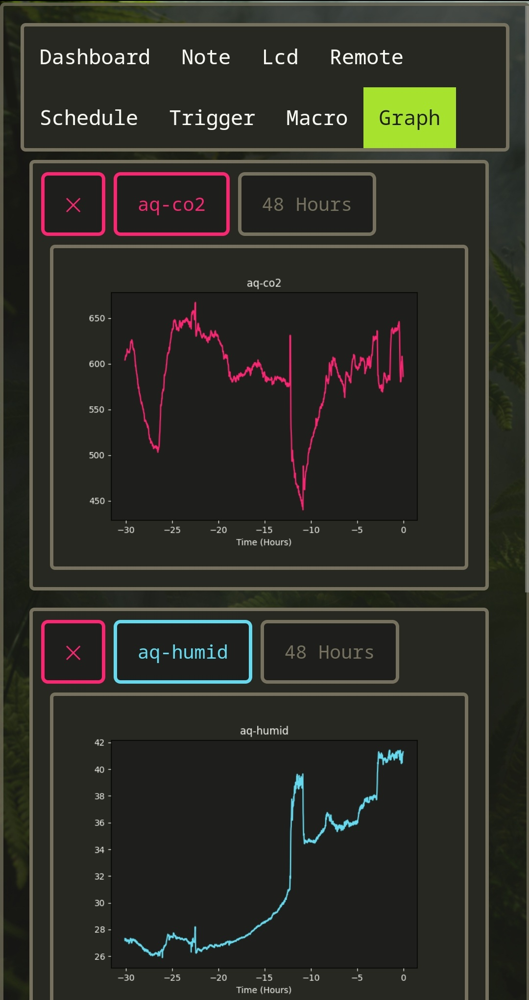

# Smart Home Server
> A Full Smart Home System and Associated IOT Devices

- [DEVICES](#devices)
- [ABOUT](#about)
  * [JOBS AND MACROS](#jobs-and-macros)
  * [DATASOURCES](#datasources)
- [PAGES](#pages)
  * [DASHBOARD](#dashboard)
  * [NOTE](#note)
  * [LCD](#lcd)
  * [REMOTE](#remote)
  * [SCHEDULE](#schedule)
  * [TRIGGER](#trigger)
  * [MACRO](#macro)
  * [GRAPH](#graph)

# DEVICES
Each device has its own `README`. Click the links to read more.

[ESP32 Air Quality Station](devices/esp32-air-quality-station/README.md) and [ESP Dashboard](devices/esp-dashboard/README.md):

 
 

Main Case and [Arduino Blinds Controller](devices/arduino-blinds/README.md):

 
 

[ESP Weather Station](devices/esp-weather-station/README.md) and [Arduino Light Switcher](devices/arduino-light-switcher/README.md):

 
 

# ABOUT
The smart-home-server (hereto called "the server") is a device for collecting data and controlling IOT devices (hereto called "devices"). The server runs a full web interface for easy control on mobile or desktop.

The server's functionality is best understood through two categories, [Jobs and Macros](#jobs-and-macros) and [Datasources](#dataSources).

## Jobs and Macros
Jobs are things the server can do, they include:
- Transmitting RF signals (for controlling RF outlets and relays)
- Sending HTTP requests
- Updating remote LCD Dashboard formats (see LCDs page)
- Running Job Macros
- Updating the server
- And more

Jobs can be organized into macros and setup to trigger in on RF signals, button presses on the server's case, or manually through the web page.

Jobs and macros can also be run using a scheduler (i.e. turn off the lights at 11pm) or can be triggered on conditions (i.e. turn on the humidifier whenever relative humidity is below 35%). See the [Schedule](#schedule) and [Trigger](#trigger) pages for more details.

Macros can also include delays and other macros.

### Example
Here is an example of a simple nighttime macro:

 
 

This macro turns off all the lights, turns off a loud air filter in the bedroom, waits for 8h30min, prevents you from oversleeping by turning on the bedroom light, and then turns everything in the bedroom off after 30 more minutes.

This macro could be hooked up to an RF button outside the bedroom to be run without having to open the web app (how I do it).

The macros like bedroom on/off would be replaced with single RF switching jobs, i.e.) `press bedroom ch: 1 on`, for the example macros where used so they could be labeled.

## Datasources
The server collects data from `datasources` with a set polling period. The data can then be used to:
- [Trigger](#trigger) server [Jobs](#jobs-and-macros) on conditions
- Displayed on the [dashboard](#dashboard)
- Create [Graphs](#graph)
- Displayed on local and remote [LCDs](#lcd)

Examples of each Application:

 
 

 
 

Datasources can be added and changed [here](smart_home_server/data_sources/__init__.py), simply:

1) Add a function which returns `{ 'str': '...', 'data':{...} }` where `str` is shown in dashboard and `data` contains the values used by triggers, graphs and etc.
2) Add an entry to `dataSources` with a `name`, `color`, desired `url`, `local` function to call, `pollingPeriod`, `values` (paths in `data` to find the datasources), and more (see existing examples).

All existing datasources can be edited using the same method. The order they appear in the `dataSources` list determines the order they appear in the dashboard, you can also add dashboard buttons to each entry, and make each entry hideable here too. See `Job Log` and `RF Log` as examples.

# Pages

## Dashboard
A page for displaying desired datasources in an easy to read way, clicking on the name tag will refresh its information. Each datasource can be customized with buttons to hide its contents, colored name tags, buttons to make HTTP requests, and more.

 
 

## Note
A page to create, display and edit notes.

 
 

## LCD
A page to add and update local and [remote LCD](devices/esp-dashboard/README.md) dashboards.

LCDs display formatted text containing datasources, i.e. `{clock} 123` will be replaced with `02:03 PM 123` and will be updated every minute when the `{clock}` changes. This format is set on the LCD page, a list of all formats is provided under `Cheat Sheet`. Numbers can be rounded like so: `{temp:.0f}` for 0 decimal places or `{temp:.1f}` for 1 decimal place.

Each LCD has its own number (0 for local and 1 or more for remote), upon power up the LCDs will reach out to the server to connect, after which the server will send updates whenever the text changes.

 
 

## Remote
A page for using, adding and editing RF remotes. The server contains an RF receiver to copy existing remotes which can then hook into the server's [job system](#jobs-and-macros), in addition to directly using the copied remote from this page.

Each remote can be named, and additional buttons can be added using the forms at the bottom of the page.

 
 

## Schedule
A page for triggering [jobs and macros](#jobs-and-macros) repeatedly on a schedule. The server can be setup to run a job on an interval or at a specific time every day or week, for example turn on the Christmas lights at 5pm every day and turn them off at 5am every day.

 
 

## Trigger
A page for triggering [jobs and macros](#jobs-and-macros) on conditions involving [datasources](#dataSources). The server can be setup to run a job whenever a condition is met, for example whenever humidity is over 30%. comparisons can be made between two datasources as well, for example if you have 2 temperature sensors in different rooms, you can trigger a fan to turn on if room A temp is less than room B temp.

Note the condition is denounced, so it will only trigger once until the condition is no longer met. Using the humidity example, going below 30% will trigger the condition, but it will not trigger again until humidity goes above 30% and then below 30% again. This is to prevent spamming.

 
 

## Macro
A page for combining [jobs (and macros) into macros](#jobs-and-macros), macros can include jobs, delays and other macros to allow the easy triggering of complex tasks manually, on schedules or using the trigger system. See the [jobs and macro section](#jobs-and-macros) for examples.

 
 

## Graph
A page for creating plots of datasources over time, new graphs can be created by selecting a datasource, a color, and a time interval to plot over. All the plots are created server side and served as an image so they can be easily saved. Clicking on the plots name or refreshing the page will update it.

 
 

