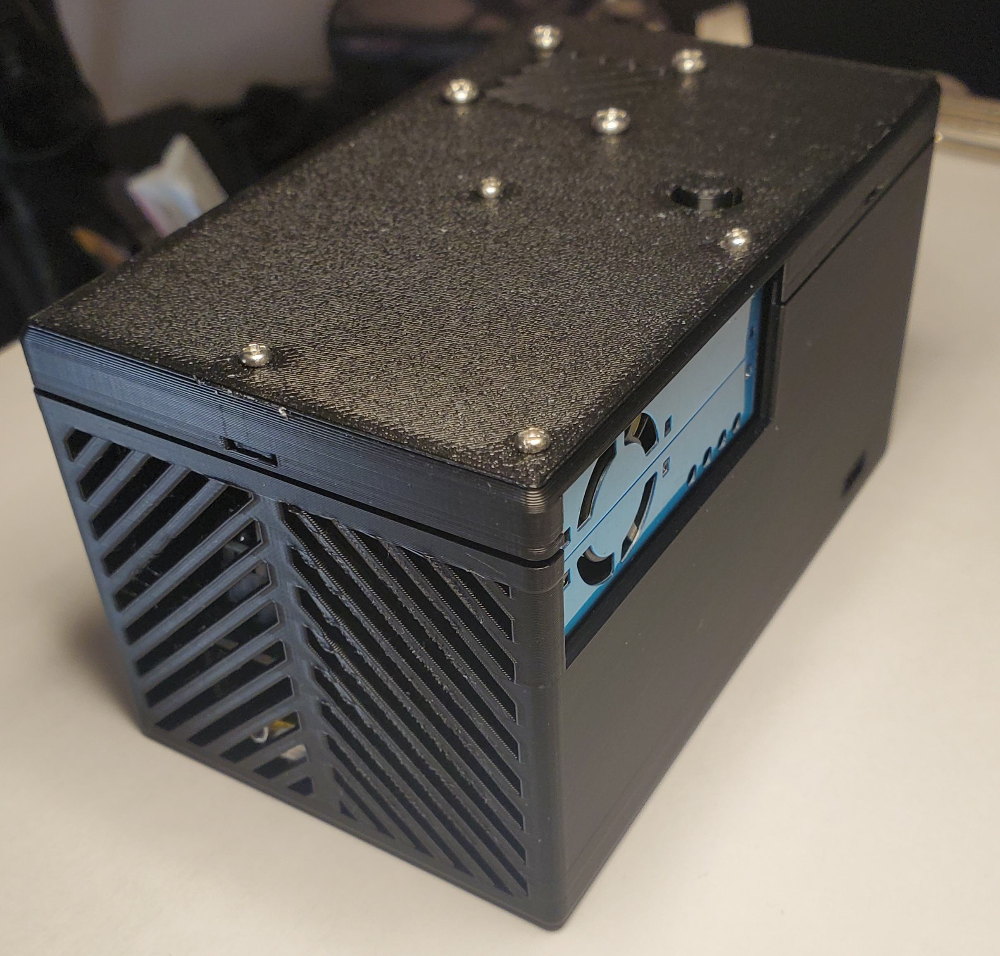
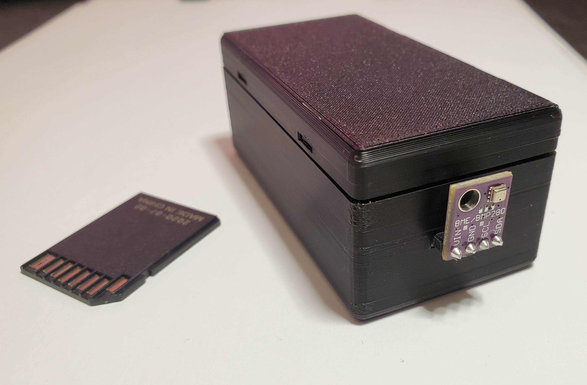

# Smart Home Server
> A Full Smart Home System and Associeated IOT Devices

- [DEVICES](#devices)
- [ABOUT](#about)
  * [JOBS AND MACROS](#jobs-and-macros)
  * [DATASOURCES](#datasources)
- [PAGES](#pages)
  * [DASHBOARD](#dashboard)
  * [NOTE](#note)
  * [LCD](#lcd)
  * [REMOTE](#remote)
  * [SCHEDULE](#schedule)
  * [TRIGGER](#trigger)
  * [MACRO](#macro)
  * [GRAPH](#graph)
- [CONFIGURATION](#configuration)

# DEVICES
Each device has its own `README`. Click the links to read more.

[ESP32 Air Quality Station](devices/esp32-air-quality-station/README.md) and [ESP Dashboard](devices/esp-dashboard/README.md):

 
 

[ESP Weather Station](devices/esp-weather-station/README.md) and [Arduino Light Switcher](devices/arduino-light-switcher/README.md):

 
 

Main Case:

 
 

# ABOUT
The smart-home-server (hereto called "the server") is a device for collecting data and controlling IOT devices (hereto called "devices"). The server runs a full web interface for easy control on mobile or desktop

The servers functionality is best understood through 2 catigories, [Jobs and Macros](#jobs-and-macros) and [Datasources](#dataSources).

## Jobs and Macros
Jobs are things the server can do, they include:
- Transmitting RF signals (for controlling RF outlets and relays)
- Sending HTTP requests
- Updating remote LCD Dashboard formats (see lcds page)
- Running Job Macros
- Updating the server
- And more

Jobs can be organized into macros and setup to trigger in on RF signals, button presses on the servers case, or manually throught the webpage.
Jobs and macros can also be run using a scheduler (ie turn off the lights at 11pm) or can be triggered on conditions (ie turn on the humidifer whenever reletive humidity is below 35%). See the [Schedule](#schedule) and [Trigger](#trigger) pages for more details

Macros can also include delays and other macros, 

### Example 
Here is an example of a simple nightime macro:

 
 

This macro turns off all the lights, turns off a loud air filter in the bedroom, waits for 8h30min, prevents you from oversleeping by turning on the bedroom light, and then turns everyting in the bedroom off after 30 more minutes. 

This macro could be hooked up to an rf button outside the bedroom to be run without having to open the web app (how I do it).

The macros like bedroom on/off would be replaced with single rf switching jobs, ie) `press bedroom ch: 1 on`, for the example macros where used so they could be labeled.

## Datasources
The server collects data from `datasources` with a set polling period. The data can then be used to:
- [Trigger](#trigger) server [Jobs](#jobs-and-macros) on conditions
- Displayed on the [dashboard](#dashboard)
- [Graphed](#graph)
- Displayed on local and remote [LCDs](#lcd)

Examples of each Application:

 
 

 
 

Datasources can be added and changed [here](smart_home_server/data_sources/__init__.py), simply:

1) Add a function which returns `{ 'str': '...', 'data':{...} }` where `str` is shown in dashboard and `data` contains the values used by triggers, graphs and etc
2) Add an entry to `dataSources` with a `name`, `color`, desired `url`, `local` function to call, `pollingPeriod`, `values` (paths in `data` to find the datasources), and more (see existing examples)

All existing datasources can be edited using the same method. The order they appear in the `dataSources` list determines the order they appear in the dashboard, you can also add dashboard buttons to each entry, and make each entry hidable here too. See `Job Log` and `RF Log` as examples.

# Pages

## Dashboard
Displays desired datasources in an easy to read way, clicking on the name tag will refresh its information. 

## Note

## Lcd

## Remote

## Schedule

## Trigger

## Macro

## Graph

# Configuration
