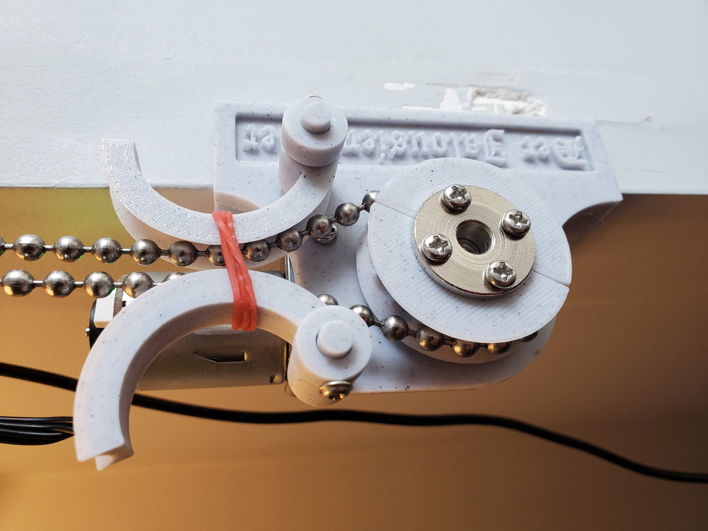
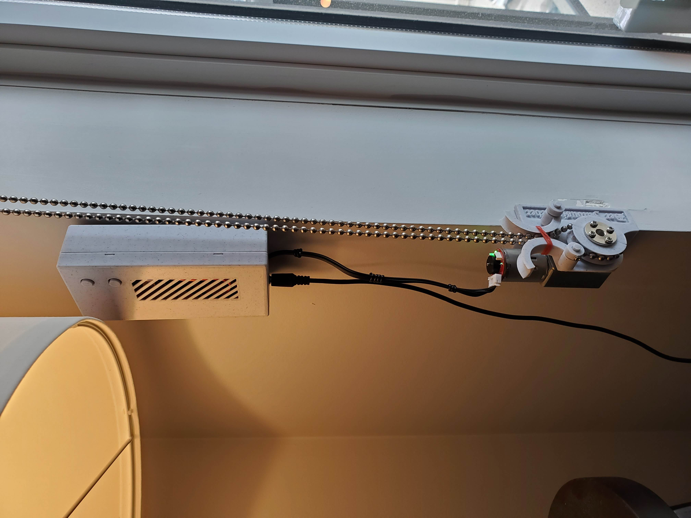
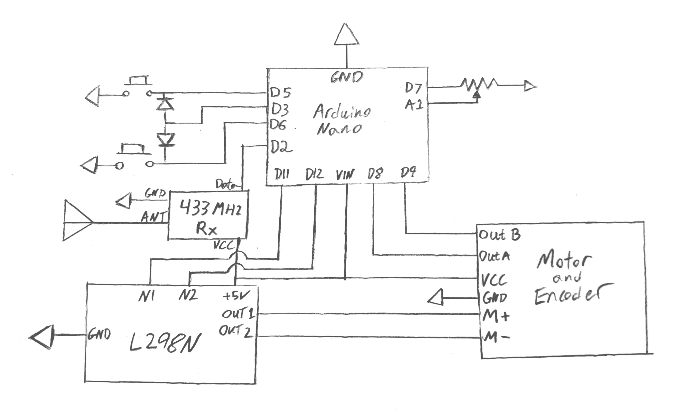
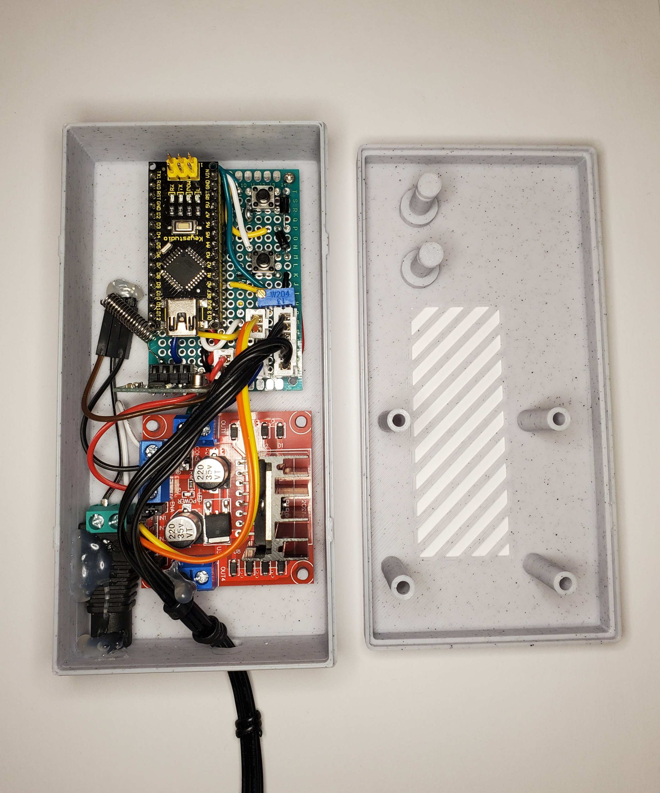
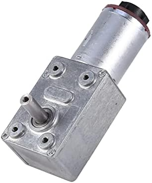
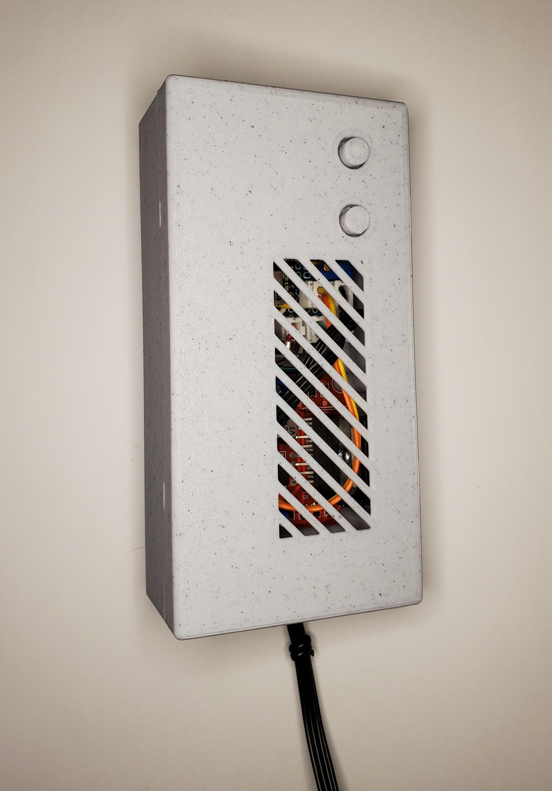

# arduino-blinds
> A Device for Opening and Closing Bead Chain Blinds



<br clear="left"/>
<br clear="left"/>

- [ABOUT](#about)
- [CREATION](#creation)
  * [MATERIALS](#materials)
  * [ASSEMBLY](#assembly)
  * [PROGRAMMING](#programming)
- [OPERATION](#operation)
  * [HARDWARE ERRORS](#hardware-errors)


# ABOUT
This device uses a dc motor and chain gear to open and close blinds, requires no changes to the mechanics of the blinds to be installed.

The device is controlled with RF remotes as well as push buttons on the case.

# CREATION

## Materials
I will divide this into sections, most things can be improvised with small design tweaks and case/mechanical modifications (case.scad, mechanical.scad).

##### Primary
- Arduino nano 
- 433 MHz Rx Module
- 433 MHz antenna
- L298N H-Bridge Motor Controller
- 2 Diodes
- 1 Potentiometer
- 12V Motor with gearbox (10RPM to 40RPM, lower RPM for heavy blinds. See photos)
- Motor encoder (mine was build into motor)

##### Connections
- Prototype boards (mine are 6x4 cm)
- Header socket pins
- JST-XH connectors and crimp
- DuPont connectors and crimp
- 22 gauge stranded wire
- 22 gauge solid core wire
- Soldering equipment
- Momentary push button
- 12v female barrel connector breakout
- 12v male barrel connector cable

##### Case and Mechanical
- 3D printer (I use PLA+ for everything)
- M2, M3 screws
- M3 Hex bolts
- M2.5 self tapping screws
- Hot glue gun (to hold the power board)
- 6mm Flange Coupler and set screw (optional, use for heavy blinds)
- Small elastic 
- Silicon grease
- Assorted Command strips (for attaching motor and case to wall)

## Assembly

Below is a schematic of the device, along with photos of the assembly. Solder the sockets to the prototype board and connect them according to the schematic, I used JST-HX connectors, however direct soldering or DuPont connectors could also be used.

For the mechanical portion the scad file as a module called `fullAssebmly();` all the parts together. There are 2 chain gear options, one fully PLA+, the other PLA+ with a metal flange coupler for the motor shaft.

Here's a rough breakdown of the assembly:
- Put 2 washers with some grease on each of the posts sticking out of the base
- Put the 2 chain guides on the posts as shown in the images, again with some grease
- Add another washer and grease to each post along with the collar, secure the collars to the shaft using M2.5 self tapping screws (you may need to pre-drill a bit)
- Screw the motor and gear box to the base

For the PLA+ Chain gear: 
- Put 2 washers over the shaft, then friction fit the chain gear onto the shaft (with some grease between the washers and chain gear)

For the Chain gear with coupler: 
- The chain gear will go on the underside of the coupler, attach the coupler to the shaft and set the set screw, you want the chain gear to line up with the chain guides
- Press fit hex bolts into the hexagonal slots on the chain gear halves.
- Install both halves of the chain gear to the coupler using M3 screws, the chain gear should align with the chain guides, if not take off the halves and adjust the height with the set screw

Both:
- Stretch an elastic between the chain guides as shown in the photo, these will be used for chain tensioning
- Feed the chain between the guides and elastic as shown in the photo, and spread the chain over the chain gear
- Clean the wall and base to prepare both surfaces for command strips (helps with adhesion)
- Put command strips on the base, use a good number of them so you get a secure connection to the wall
- Pull the full assembly down and stick it to the wall, you want the chain tensioners be slightly pulled apart by the tension, as shown in the image
- Press and hold the assembly into the wall for 30 seconds to ensure solid adhesion


### Schematic


<br clear="left"/>
<br clear="left"/>

### Photos

Mechanical and Electrical:



<br clear="left"/>
<br clear="left"/>

Motor Gearbox and Case:



<br clear="left"/>
<br clear="left"/>

Full system:


<br clear="left"/>
<br clear="left"/>

## Programming

The following command will build and get serial output on Linux, You may need to change USB0 to some other number for your machine:
```
arduino-cli compile --fqbn "arduino:avr:nano" -u -p /dev/ttyUSB0 && screen /dev/ttyUSB0 9600
```

# Operation
The RX codes can be set by holding the up button and restarting the Arduino, you should see slow steady flashing indicating you're in code setting mode. The system will wait for the up code followed by the down code, saving both to the EEPROM. The led with do 3 quick flashes to indicate a code has been heard.

The Arduino considers anything below a certain speed a stall and will stop the motor. this can be set using the Potentiometer and is read at boot. 

Holding the down button on restart enters a debug mode for setting the Potentiometer, the led will flash on for `N` milliseconds, corresponding to the stall speed of `N` encoder ticks per second. In this mode you can turn the Potentiometer to adjust the speed and the led flash rate will update accordingly. Reset the Arduino to exit the mode and test the results.

The led will turn on when the motor is moving, test the blinds opening and closing and make sure the led turns off when the blinds reach the top and bottom. The motor has a backup shut off after 3 minutes of continuous running in case a mechanical failure occurs (IE chain skipping, chain gear getting sheared off the shaft, etc).

