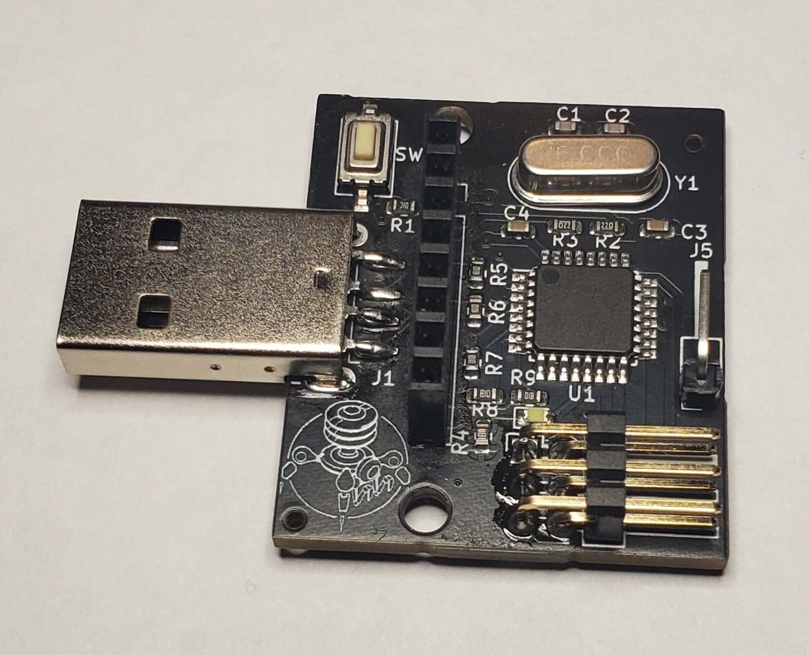

# Atmega16u2 Monitor
> An OLED and LCD USB Device for Displaying Graphs from smart-home-server


<br clear="left"/>
<br clear="left"/>

- [ABOUT](#about)
- [CREATION](#creation)
- [OPERATION](#operation)
- [TROUBLESHOOTING](#TROUBLESHOOTING)


# ABOUT
This device is a plug and play graph monitor for smart-home-server's data sources, when plugged in it will automatically connect to the server and start displaying whichever graph is selected in the UI (by pressing the `Monitor` button shown below). The image is updated whenever new data is added to the graph. 


<br clear="left"/>
<br clear="left"/>

The device features a custom PCB built around the Atmega16u2


<br clear="left"/>
<br clear="left"/>

# CREATION

### PCB Creation and Assembly

JLCPCB was used for PCB creation and the majority of PCB assembly, files are provided in `./pcb/product`, these can be directly dropped into JLCPCB. The only things hand soldered are the USB connector, oscillator and debug header pin J5 (which is optional).

The schematic, PCB and components used can be edited in Kicad using file `./pcb/pcb.kicad_pro`, the JLCPCB files come from a plugin called `fabrication toolkit`.


<br clear="left"/>
<br clear="left"/>

### Display

I have tested with waveshare's OLED 1.5 inch display as well as their 1.8 inch LCD display. The type of display and its size are selected in `./firmware/config.h` wider displays my require increasing the number of `CHUNKS_PER_LINE` due to RAM limitations of the Atmega16u2.

The display's pins slot directly into the 8 pin port on the board. The pinout is `VCC, GND, DIN, CLK, CS, DC, RST, BL`. For OLED displays, `BL` is not used.

### Physical Assembly

3D printable Cases for the 1.5 inch OLED and 1.8 inch LCD are provided under `./case/*.stl` as well as the openscad sources under `./case/*.scad`. Additional sizes can be added by editing `screenWidth` and `screenHeight` in the `.scad` files. Separate files exist for the OLED and LCD variants due to different pin locations.

The display is secured to the board using m2.5 standoffs as shown below, Note the OLED variant only uses one standoff due to its different form factor.


<br clear="left"/>
<br clear="left"/>

The screen is secured to the case using m2.5 screws, which screw into the standoffs (where present) or nuts. Nuts can also be used as spacers between the screen and case if desired.


<br clear="left"/>
<br clear="left"/>

### Firmware and Fuses

Fuses must be set on the Atmega16u2 for it to use the crystal resonator, these can be set by running:
```
./fuses.sh
```

The fuses should be `efuse: 0xF4`, `hfuse: 0xD9`, `lfuse 0xFF`. They can then be checked with:
```
./check_fuses.sh.sh
```

Fuses only need to be set once per device. Firmware can be uploaded by running the following.
```
./build.sh
```

The build relies [Hoodloader2](https://github.com/NicoHood/HoodLoader2) and [Hid Project](https://github.com/NicoHood/HID). The former makes the Atmega16u2 compatible with Arduino's build system and the latter is a library which manages the RawHID interface.

### UDEV and Testing
A UDEV rule must be added for Linux to know what to do with the USB device, smart-home-server does this automatically when installed. For local testing, a UDEV rule can be added by running the following script (once).
```
./udev.sh
```

After this, when the device is plugged in, it can be tested using the python script shown below. It will show a test graph and cycle through various line colors every 5 seconds.
```
python3 ./test.py
```

### Debugging
Uncomment `#define DEBUG_ENABLED` in `./firmware/config.h` and connect pin `J5` to the `RX` pin of a serial interface (I use a UART to USB adapter). This will give you serial debugging, several debug prints already exist in the code. Be mindful, `debug("test string");` stores the string `"test string"` in global RAM which can run out quickly on the Atmega16u2 and cause stack overflows. To give you more overhead, debug mode lowers the chunk size of the screen buffer. 

Several macros exist for debug printing: `debug(x), debugln(x), debugS(x), debugSln(x)`. The `ln` variants print a newline after `x`, the `S` variants coerce `x` to a string before printing.


A debug led is hooked up to pin `D6` (also known as pin `19`). Its free to use for debugging and is not accessed by anything else in the firmware.


# Operation
Once the device is assembled it can be plugged into the server, You can then select a graph to push to the screen. Only one graph can be shown at a time, the selected graph will have a grayed out button saying `Monitoring`, other graphs will have a colored button that says `Monitor`.


<br clear="left"/>
<br clear="left"/>

The graph updates whenever there is new data to display, the x axis is time relative to when it was last updated with time units displayed at the top. 


<br clear="left"/>
<br clear="left"/>


# TROUBLESHOOTING

### USB not Connecting
The device should appear as a raw hid device under `/dev`, unplug it and run `ls /dev/hid*`, plug it back in and wait for a second, then run `ls /dev/hid*` again, a new device should appear. 

You can also run the following command to check for USB add, bind, unbind and remove events.
```
udevadm monitor
```

If no device appears, it could be:
- device isn't plugged in properly
- firmware isn't flashed
- fuses aren't set correctly
- UDEV rule wasn't copied
- UDEV rules weren't reloaded
- hardware issues

Ensure the hardware is working using either serial debugging, or by blinking the debug led. You can also sniff USB traffic by connecting to the middle to pins on the USB adapter.

### Freezing
The device can freeze if undervolted (happens below 4v), some cheap USB splitters can cause this, if it occurs, try connecting directly to a USB port on your computer. The smart-home's USB ports have no issues. Freezing typically happens mid screen update.

### Slow Updating and USB Disconnects
Typically happens when the fuses are set incorrectly, check them with `./check_fuses.sh`. If the fuses are set fine check if `python3 ./test.py` changes color every 5 seconds. If so the timing is fine. If not, try re-running `./fuses.sh` (I've had say it succeeded, but the fuses remained unset). during normal operation, update speed is limited by chunk size which can be adjusted in `./firmware/config.h` by changing `#define CHUNKS_PER_LINE` fewer chunks is faster but uses more RAM and can lead to stack overflows.


