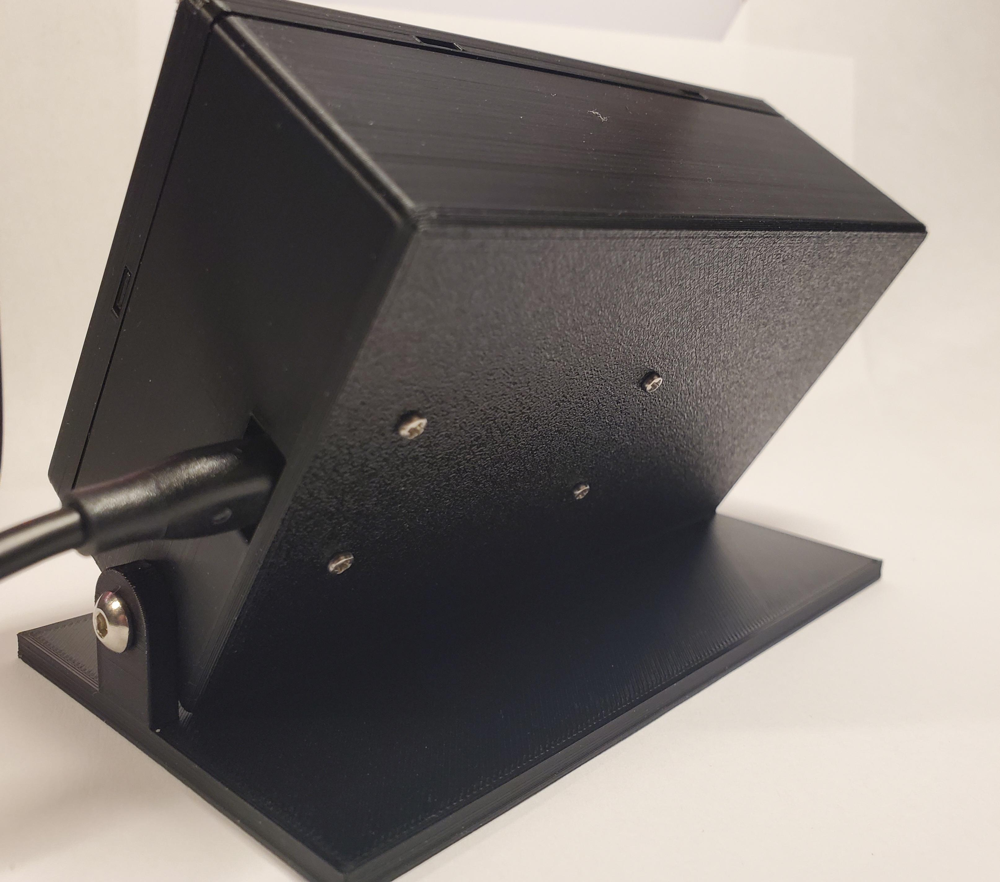
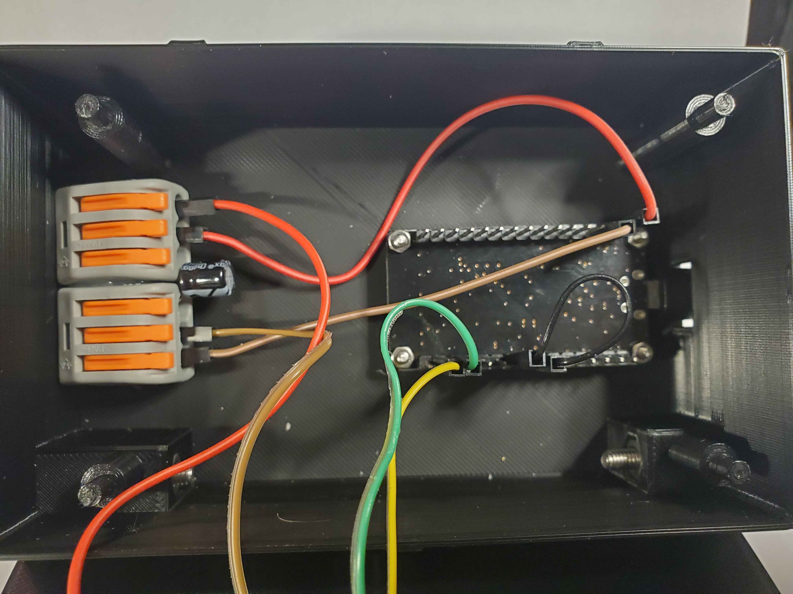
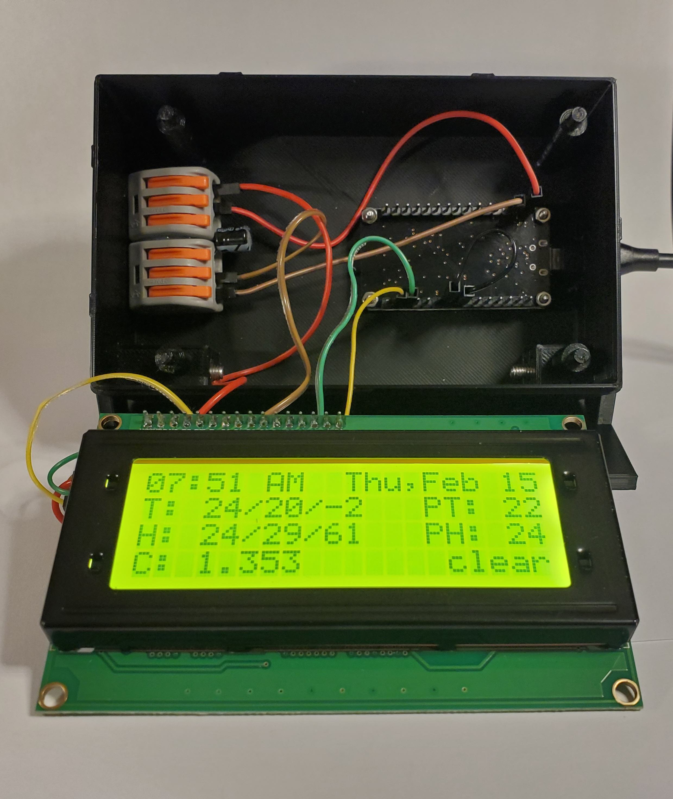
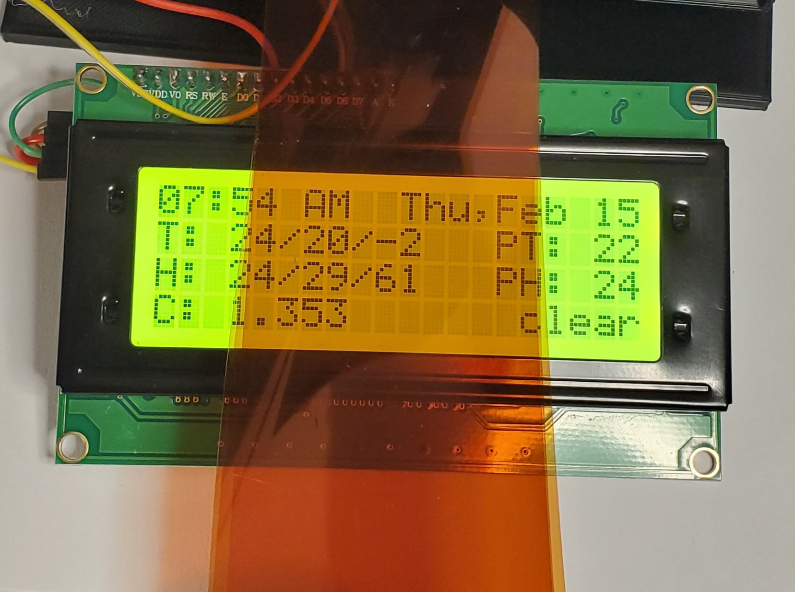

# ESP8266 Dashboard
> A Remote Device for Displaying Information From smart-home-server



<br clear="left"/>
<br clear="left"/>

- [ABOUT](#about)
- [CREATION](#creation)
  * [MATERIALS](#materials)
  * [ASSEMBLY](#assembly)
  * [PROGRAMMING](#programming)
- [OPERATION](#operation)


# ABOUT
This device is a remote dashboard for displaying formatted information from smart-home-servers data sources, when powered on it will automatically connect to the server and present its LCD number, the server will then update the LCD whenever the data contained in the format is updated.

# CREATION

## Materials

- 3D Printer
- ESP8266 nodeMCU
- 20x4 LCD I2C module
- DuPont Jumper cables
- M2 Screws and nuts
- M4 Screws and nuts
- 220 uF capacitor (optional, helps reduce LCD flicker)
- wire splicing or soldering (needed if capacitor is used)
- Orange light filter sheets (optional to change LCD color)

## Assembly

1) 3D print the case body, lid and platform.
2) Put the ESP8266 into the case upside down on the risers, with the port facing the USB cutout, screw M2 screws through the risers and secure the ESP8266 with M2 bolts.
3) Screw M4 screws through the holes in the base and then into the body of the case (longer part of the base should point backwards), put press bolts into the hexagonal holes in the body to secure the screws.
4) Connect the `SCL`, `SDA`, `GND`, and `VCC` pins to the LCD. For `VCC`/`GND`, splice them with the capacitor if desired (see image of internals below).
5) Grounding pins `D4`, `D5` and `D6` can be used to select different LCD Numbers to allow for 8 dashboard to be used with the same smart-home-server (see image of internals below)
6) Press the LCD onto the outer riser posts, the I2C wires should point to the left to give them more room.
7) Press the front cover on the body, it should snap into place.
8) (optional) cut out orange light filter to be slightly larger than the front opening of the case, add multiple layers to achieve desired color, tape the layers together and put in opening to cover the LCD.

Device internals:



<br clear="left"/>
<br clear="left"/>

Color filter demo:


<br clear="left"/>
<br clear="left"/>


## Programming
For debug output, uncomment `// #define DEBUG_ENABLED` in `esp-dashboard.ino` line 12.

You must create the file `network-info.h` containing the following in this directory:

```
#define NETWORK_NAME "NETWORK123"    // your wifi network name
#define NETWORK_PASS "XXXXXXXXX"     // your wifi password
#define SERVER_IP    "192.168.1.123" // Your smart-home-server ip address
```

The following command will build and get serial output on Linux, You may need to change USB0 to some other number for your machine:
```
arduino-cli compile --fqbn "esp8266:esp8266:nodemcuv2" -u -p /dev/ttyUSB0 && screen /dev/ttyUSB0 115200
```


# Operation
Once powered on the device display diagnostic information as goes through the steps to connect to `smart-home-server`. It will connect to WiFi and then attempt to reach out to the server, after which, it will present its LCD number to which the server will reply with the corresponding format. From there the server will update the device whenever the data changes.

The format is set on the `Lcd` tab of the `smart-home-server`. Here you can also toggle the backlight of each LCD by pressing its LCD number.

If no format is set for that LCD number, the server will display a message saying so on the device.

Screenshot of `smart-home-server`'s Lcd tab:


<br clear="left"/>
<br clear="left"/>
