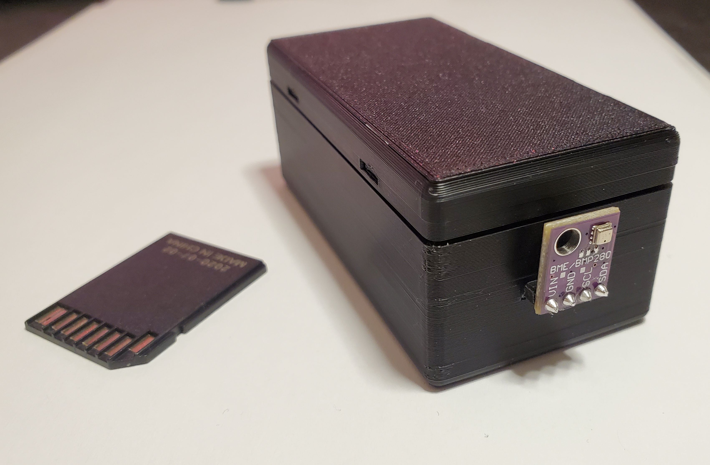
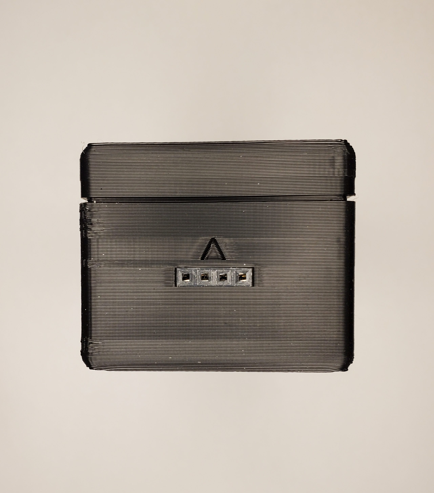
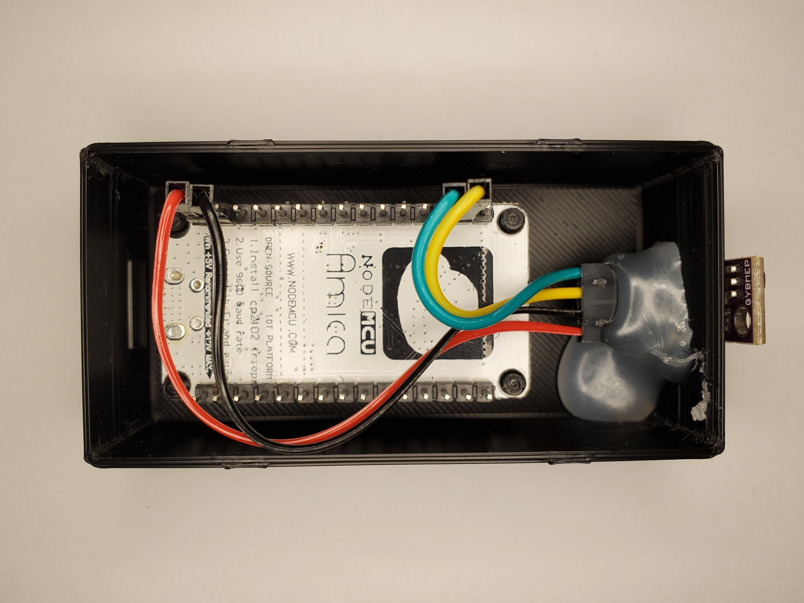

# Esp8266 Weather Station
> A Device for Monitoring Temperature, Humidity and Pressure


<br clear="left"/>
<br clear="left"/>

- [ABOUT](#about)
- [CREATION](#creation)
  * [MATERIALS](#materials)
  * [ASSEMBLY](#assembly)
  * [PROGRAMMING](#programming)


# ABOUT
This device contains the BME280 sensor For Measuring Temperature, Humidity and Pressure. It operates as a UDP Server to allow for remote collection of data.

# CREATION
There are 2 case variants, one has a cutout so it can be powered by USB, the other is powered by DuPont Jumpers. For outdoor use I would recommend the latter as it is more easily weather proofed.
I will refer to these as (USB case) and (jump case)

## Materials

- Esp8266 Node MCU
- BME280 I2C board
- DuPont connectors and crimp
- 1x4 DuPont housing (USB case) or 1x6 DuPont housing (jump case)
- 22 gauge stranded wire
- 3D printer
- Hot glue gun
- Micro USB power cable and wall adapter

## Assembly
I will call the front of the case the side with the thin slit for the DuPont housing, making the back the wall closer to the risers.

The BME280 will be mounted outside of the front the case, with the board facing the direction indicated by the arrow (up).

1) 3D print the case and lid.
2) Cut and crimp DuPont wires to run from the front of the case to the Esp8266 pins, from left to right the wires should run to pins: `VIN`, `GND` (jump case only) and `3V3`, `GND`, `SCL`, `SDA` (both cases).
3) Place the crimped cables into the relevant housing (1x4 for USB case, 1x6 for jump case). The openings on the housing should face down (so no glue gets in later).
4) Press the DuPont housing into the front case slit, the front of the housing should be flush with the front of the case.
5) Secure and seal the DuPont housing with hot glue on the inside of the case.
6) Put the ESP8266 into the case upside down on the risers, with the port facing the back.
7) Connect the DuPont wires to the Esp8266 pins (see step 3 for which wire goes where).
8) Press the lid on the case, making sure the risers match the posts on the lid, it should snap into place.


### Photos



<br clear="left"/>
<br clear="left"/>

## Programming
For debug output, uncomment `// #define DEBUG_ENABLED` in `esp-weather-station.ino` line 11.

You must create the file `network-info.h` containing the following in this directory:

```
#define NETWORK_NAME "NETWORK123"
#define NETWORK_PASS "XXXXXXXXX"
```

The following command will build and get serial output on Linux, you may need to change USB0 to some other number for your machine:
```
arduino-cli compile --fqbn "esp8266:esp8266:nodemcuv2" -u -p /dev/ttyUSB0 && screen /dev/ttyUSB0 115200
```

A UDP request can be made to the device using the following command:

```
./udp_request.sh "1" 192.168.1.123

```
replace the IP address with the address of your Esp8266 (check your router for the address once its connected, or the Esp8266's debug output)

