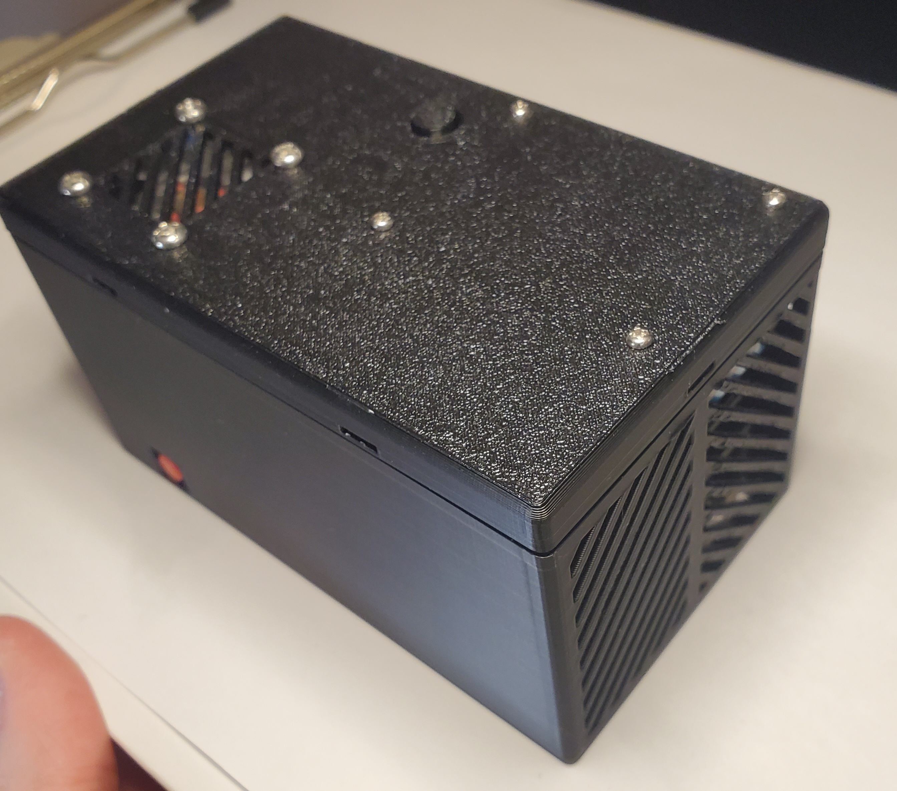
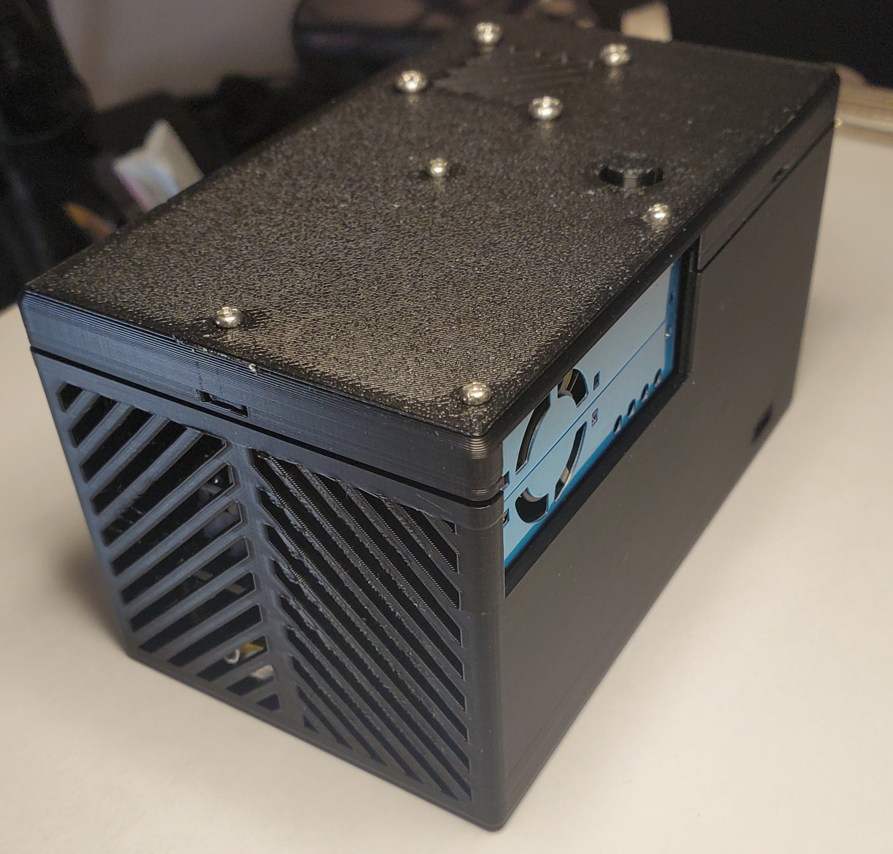
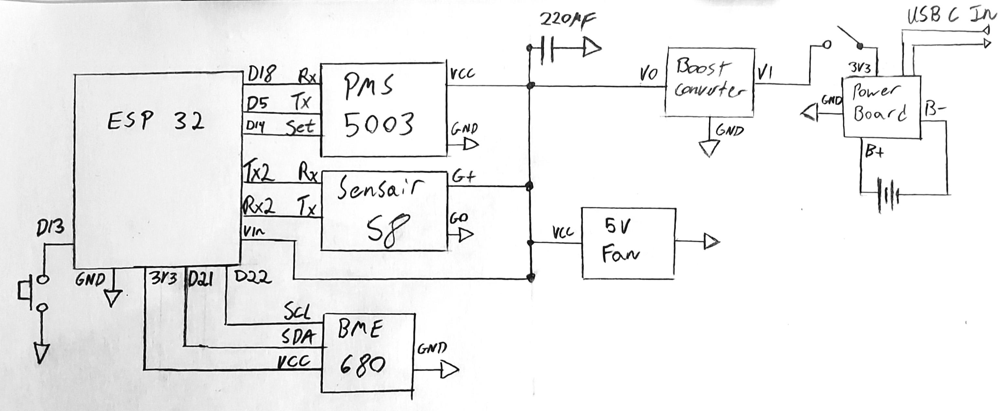
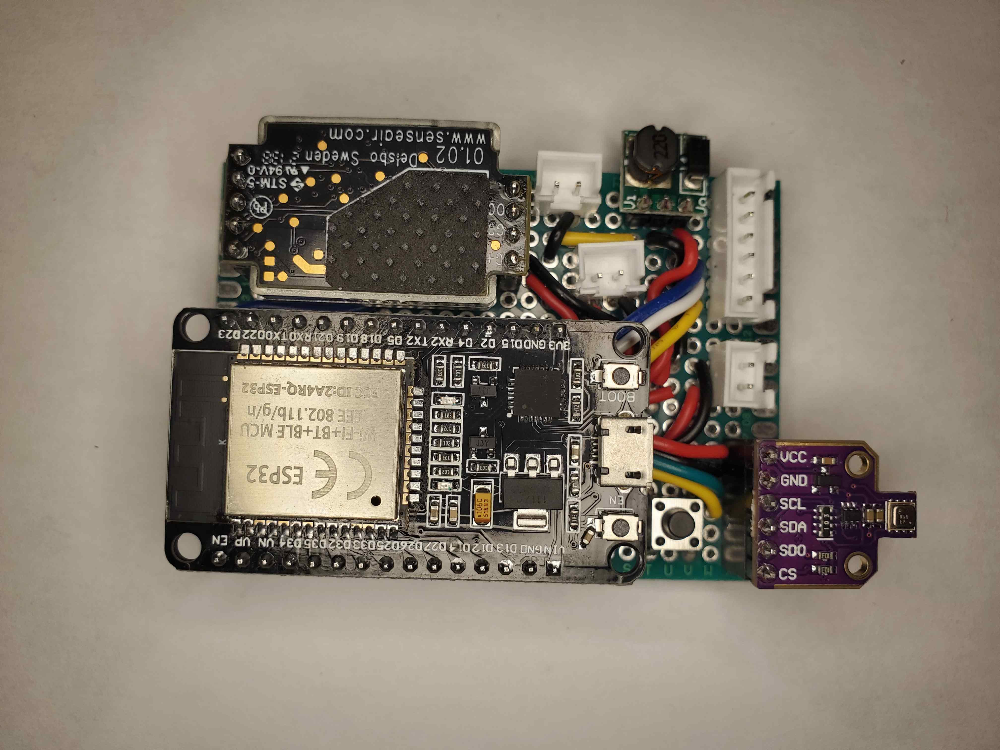
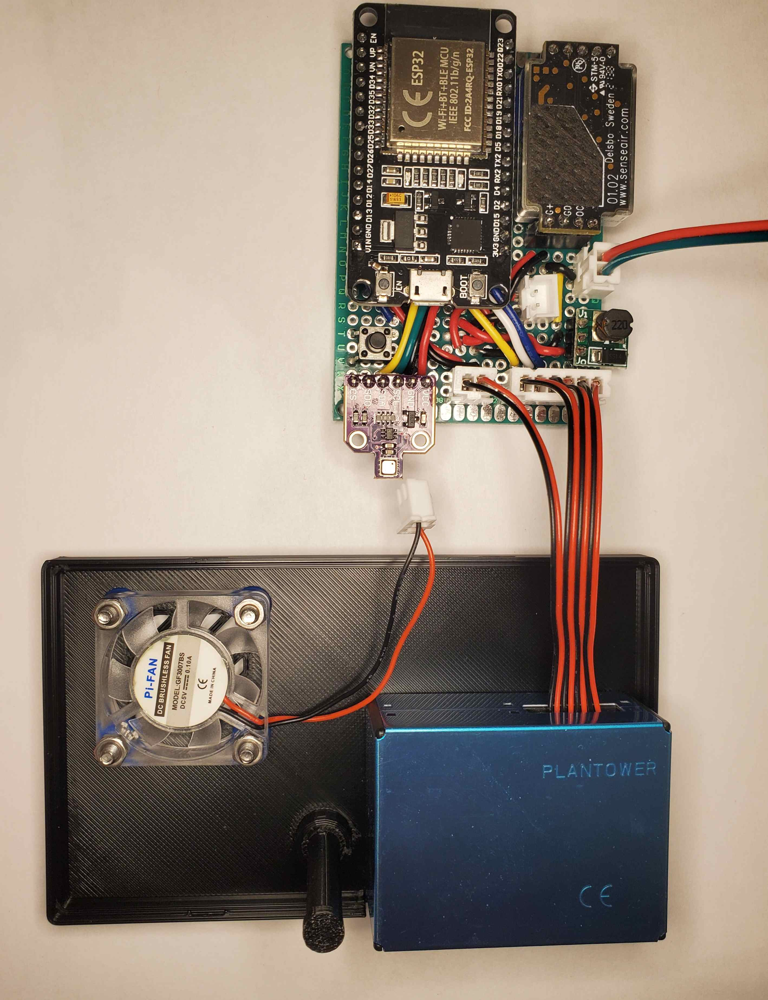
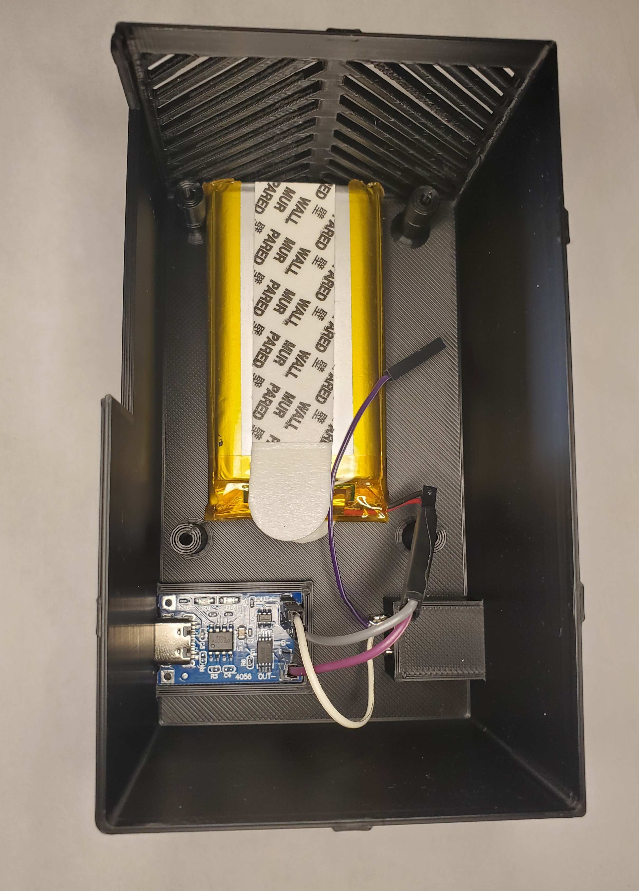
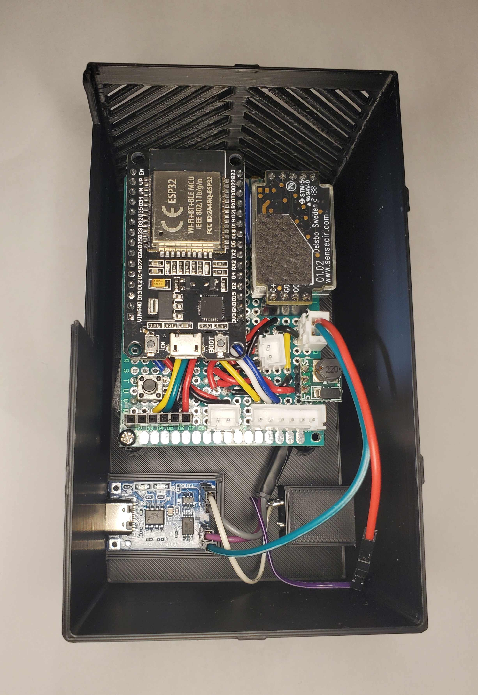
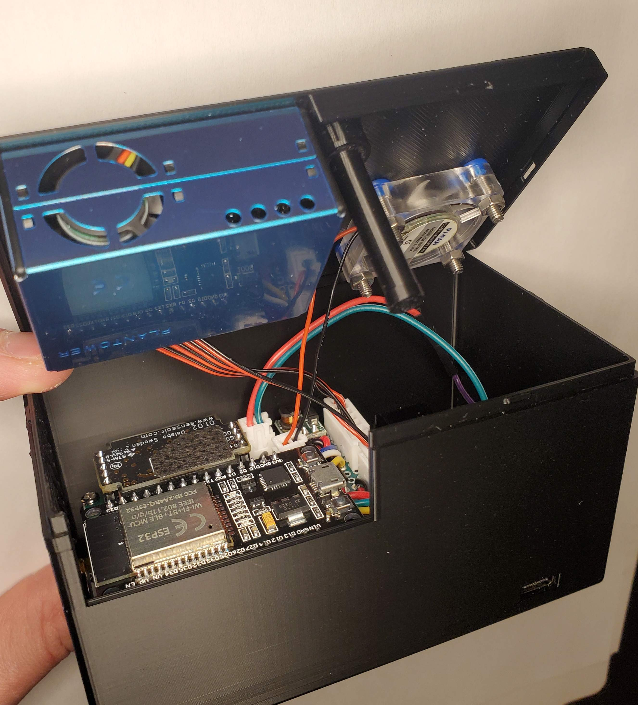

# Esp32 Air Quality Station
> A Device for Monitoring Co2, VOCs, PM1, PM2.5, PM10, Temprature, Humidity, Pressure, and overall Air Quality (IQA)



<br clear="left"/>
<br clear="left"/>

- [ABOUT](#about)
- [CREATION](#creation)
  * [MATERIALS](#materials)
  * [ASSEMBLY](#assembly)
  * [PROGRAMMING](#programming)
- [OPERATION](#operation)
  * [HARDWARE ERRORS](#hardware-errors)


# ABOUT
This device contains the following sensors:
- PMS5003    (Particulate Sensor)
- Sensair S8 (Co2 Sensor)
- BME680     (Assorted Gas Sensor)

For Measuring Co2, VOCs, PM1, PM2.5, PM10, Temprature, Humidity, Pressure, and overall Air Quality (IQA).

The device operates as a UDP Server, to allow for remote collection of data. It is also battery operated primarly for Co2 Calibration (easier to bring outdoors for calibration).

# CREATION

## Materials
I will divide this into sections, most things can be improvised with small design tweaks and case modifications (case.scad).

##### Primary
- ESP32 30 pin
- Sensair S8
- PMS5003
- BME680 I2C board
- boost converter (5V output)
- 3.3V lipo pack
- USB C Battery charing board (mine are 17.5mm by 28.4mm)
- 30 mm fan

##### Connections
- prototype boards (mine are 7x5 cm)
- header socket pins
- JST-XH connectors and crimp
- dupont connectors and crimp
- 22 gauge stranded wire
- 22 gauge solid core wire
- soldering equiptment
- toggle button (power button mine are 8.6mm square)
- momentary push button (calibration button)

##### Case
- 3D printer (for the case)
- M2, M2.5, M3 screws
- hot glue gun (to hold the power board)
- USB C power cable and wall adapter

## Assembly

Below is a schematic of the device, along with photos of the assembly. Solder the sockets to the prototype board and connect them according to the schematic, I used JST-HX connectors for the PMS5003, Fan and powerboard, however direct soldering or dupont connectors could also be used.

For the case, the PMS5003 and Fan attach to the lid, along with the shaft/guide to push the Co2 calibration button. You must glue the small circular plate the bottom of the button shaft to hold it in the guide. Lastly the power button and power board are fitted into the case as shown, with the leads of the power button being soldered to dupont jumpers as shown in the photos.

### Schematic


<br clear="left"/>
<br clear="left"/>

### Photos



<br clear="left"/>
<br clear="left"/>



<br clear="left"/>
<br clear="left"/>



<br clear="left"/>
<br clear="left"/>

## Programming
For debug output, uncomment `// #define DEBUG_ENABLED` in `esp32-air-quality-station.ino` line 10.

You must create the file `network-info.h` contining the following in this directory:

```
#define NETWORK_NAME "NETWORK123"
#define NETWORK_PASS "XXXXXXXXX"
```

The following command will build and get serial output on Linux, You may need to change USB0 to some other number for your machine:
```
arduino-cli compile --fqbn "esp32:esp32:esp32" -u -p /dev/ttyUSB0 && screen /dev/ttyUSB0 115200
```

A UDP request can be made to the device using the following command:

```
./udp_request.sh "1" 192.168.1.123

```
replace the IP address with the address of your ESP32 (check your router for the address once its connected, or the esp32's debug output)


# Operation
Once powered on, the device will gather its first sample and connect to wifi (Takes 30 seconds because of the PMS5003), The esp32's indicator LED (and power led) will be continuously on, it will turn off once this is done

Once the initalization is done and the indicator led is off (power led will still be on), the device will serve data whenever a udp request is made to it

## Hardware Errors
In the event of a hardware error, the ESP32s indicator LED will blink, the number of flashes indicates the error:
- BME680:     2
- PMS5003:    3
- Sensair S8: 4
- Other:      5

